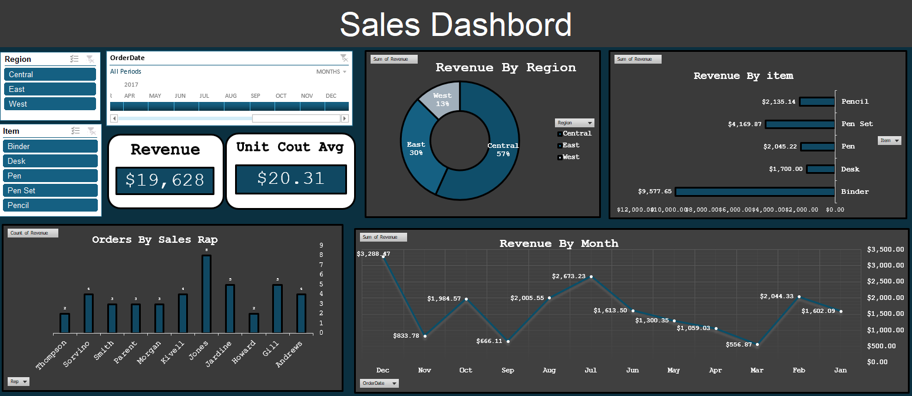

# Sales_Dashboard_Excel
my first project, where I created a dynamic and interactive dashboard in Excel! 
I used pivot tables and charts make the data more insightful, and organized everything with slicers for easy filtering. 
The dashboard helped visualize key trends and made the data easier to understand.

